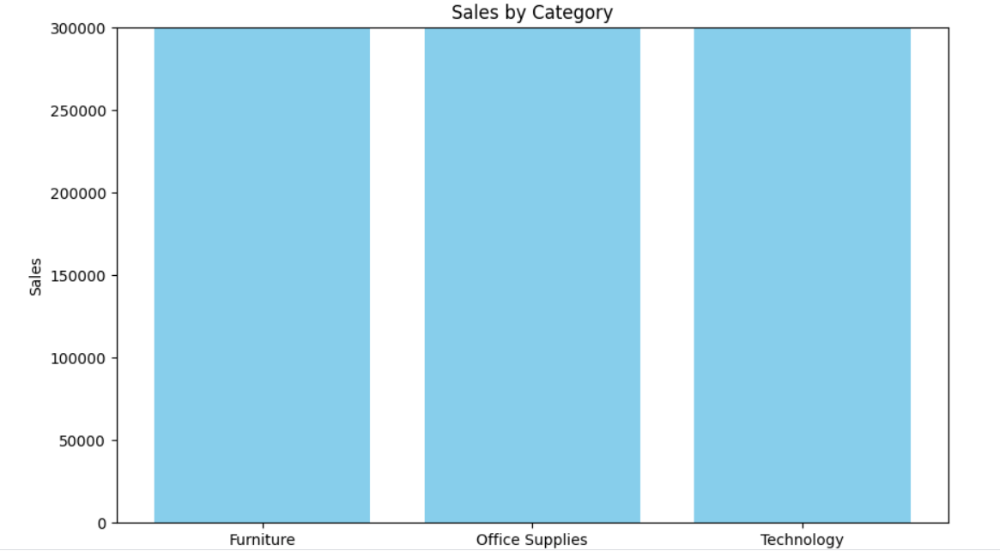
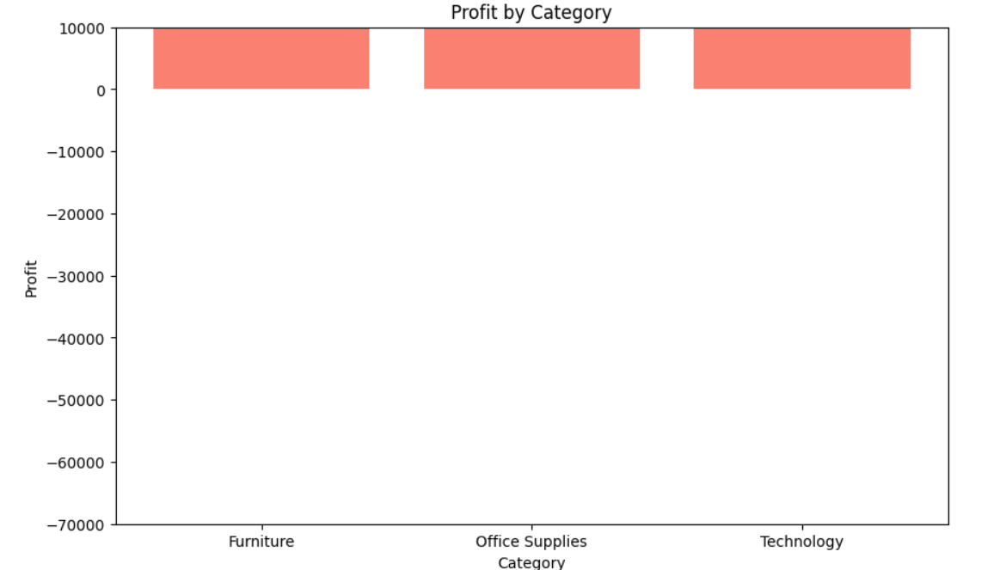
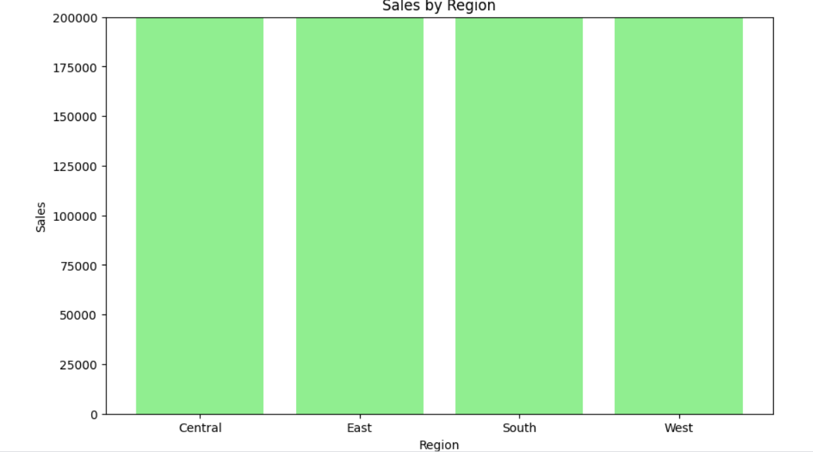
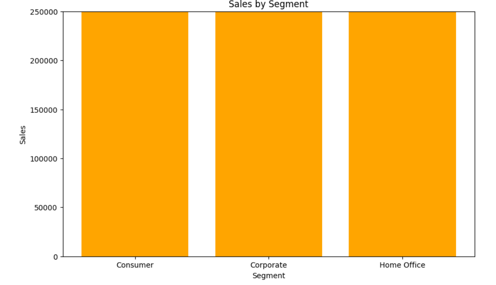

Superstore Sales & Profit Analysis  
Business Intelligence Project | Python · Kaggle · Google Sheets · GitHub

📊 Project Overview
This project analyzes sales, profit, customer segments, and regional performance using the Superstore dataset.  
The goal is to identify margin leakage, regional opportunities, and actionable business insights supported by data visualization.

The analysis includes:
- Category-level sales & profitability
- Regional performance comparison
- Customer segment behavior
- Discount impact on profitability
- Actionable recommendations for business improvement

---

🚀 Key Insights
- **Technology** is the most profitable category with strong margins.  
- **Furniture** generates high sales but operates at a loss → requires pricing & cost review.  
- **East** region leads in sales; **South** region underperforms.  
- **Consumer** segment is the primary revenue driver.  
- Overall profitability is **negative** due to aggressive discounting and low-margin categories.

---

📈 Visuals Included
- Sales by Category  
- Profit by Category  
- Sales by Region  
- Sales by Segment  

All visualizations were created using **Matplotlib** and **Seaborn**.

---

🧠 Methodology
1. Data cleaning & preprocessing  
2. Exploratory data analysis (EDA)  
3. Group-by aggregations for category, region, and segment  
4. Visualization of key metrics  
5. Business interpretation of results  
6. Actionable recommendations  

---

 🛠 Tools & Technologies
- **Python** (Pandas, Matplotlib, Seaborn)  
- **Kaggle Notebook**  
- **Google Sheets**  
- **GitHub**  
- **Jupyter Notebook**  

---

📁 Repository Structure
superstore-sales-analysis/
│
├── Superstore Sales & Profit Analysis.pdf     # Full BI report
├── superstore_analysis.ipynb                  # Kaggle notebook
├── README.md                                  # Project documentation
└── images/                                    # Visuals 

---
📊 Visuals

📄 Reports

1. Quick Report (PDF)
High-level summary with charts and key metrics.
[Superstore Sales & Profit Analysis.pdf](https://github.com/user-attachments/files/26648410/Superstore.Sales.Profit.Analysis.pdf)

3. Full Analysis Report (PDF)
Executive summary, insights, and strategic recommendations.  
[Superstore Full Analysis Report.pdf](https://github.com/user-attachments/files/26648351/Superstore.Full.Analysis.Report.pdf)

---

▶️ How to Run the Notebook
1. Download the `.ipynb` file  
2. Upload to Kaggle or open in Jupyter Notebook  
3. Ensure dataset path is correct  
4. Run all cells sequentially  

---

📬 Contact
Gulay Keske Aksoy  
LinkedIn: 
GitHub: https://github.com/Gulaksoy  

---
