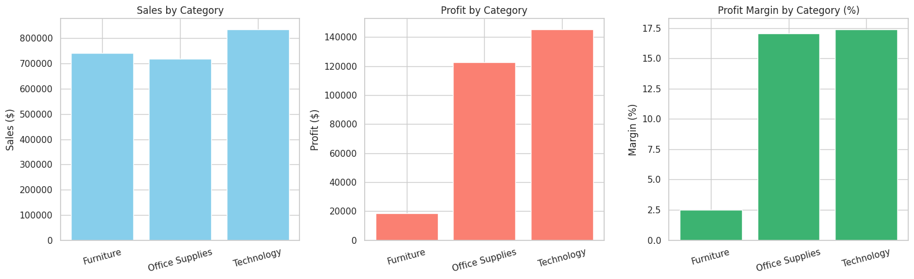
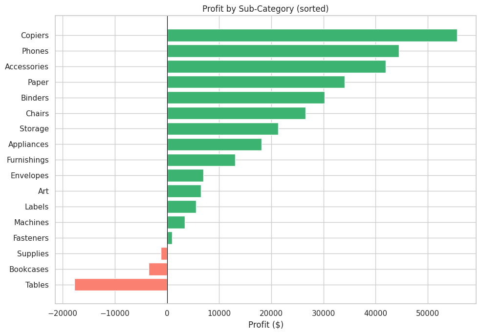
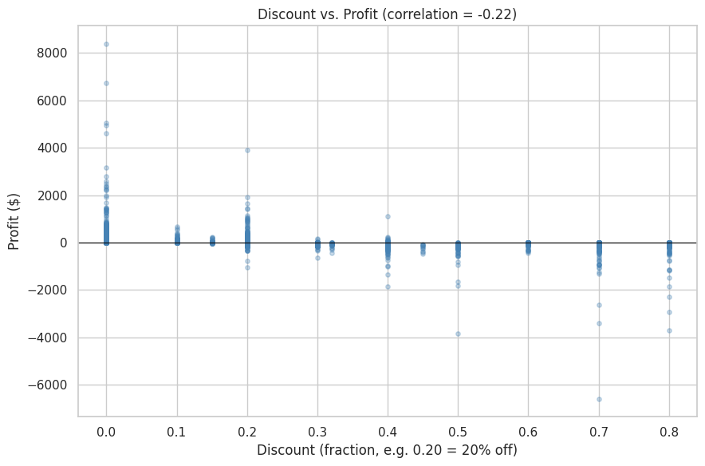
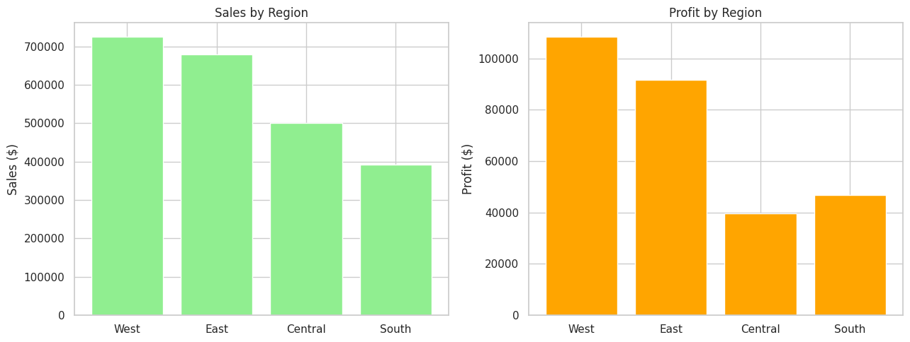
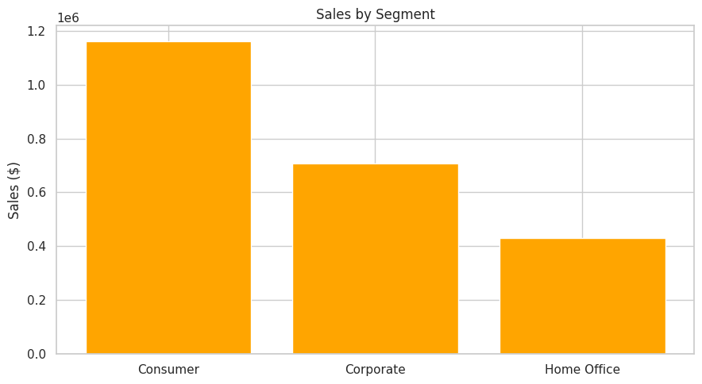

Superstore Sales & Profit Analysis
Business Intelligence Project | Python · Kaggle · GitHub

## 📊 Project Overview
This project analyzes sales, profit, customer segments, and regional performance using the Superstore dataset.
The goal is to identify margin leakage, regional opportunities, and actionable business insights supported by data visualization.

The analysis includes:

- Category-level sales & profitability, broken down to sub-category
- Regional performance comparison
- Customer segment behavior
- Discount impact on profitability (tested directly via correlation, not assumed)
- Actionable recommendations for business improvement

---

## 🚀 Key Insights

- **Technology** (~17.4% margin) and **Office Supplies** (~17.0% margin) are the most profitable categories, with strong and comparable margins.
- **Furniture** generates sales comparable to the other two categories (~$742K) but converts to only **~2.5% margin** — a pricing/cost issue concentrated almost entirely in two sub-categories: **Tables** (net loss) and **Bookcases** (thin margin). The rest of Furniture (Chairs, Furnishings) is healthy.
- Overall profitability is **positive** (~$286K on ~$2.30M sales, ~12.5% blended margin).
- Discount and profit are **negatively correlated** (r = -0.22); profitability drops sharply for orders discounted above ~30%.
- **West** region leads in total sales (~$725K), followed by East (~$679K). **South** is the weakest region overall. **Central** underperforms on profit relative to its sales rank, a pattern worth further investigation.
- **Consumer** segment is the primary revenue driver by a wide margin.

---

## 📈 Visuals Included

- Sales, Profit & Margin by Category
- Profit by Sub-Category
- Discount vs. Profit
- Sales & Profit by Region
- Sales by Segment

All visualizations were created using **Matplotlib** and **Seaborn**.

---

## 🧠 Methodology

1. Data loading & quality checks (missing values, duplicates, outliers)
2. Category-level sales, profit, and margin analysis
3. Sub-category breakdown to isolate where margin issues concentrate
4. Discount → profit relationship (correlation + scatter, not assumed)
5. Regional and segment performance comparison
6. Business interpretation and actionable recommendations

---

## 🛠 Tools & Technologies

- **Python** (Pandas, Matplotlib, Seaborn)
- **Kaggle Notebook**
- **GitHub**
- **Jupyter Notebook**

---

## 📁 Repository Structure
```
superstore-sales-analysis/
│
├── superstore-analysis.ipynb   # Kaggle/Jupyter notebook
├── README.md                   # Project documentation
└── images/                     # Visuals
```

---

## 📊 Visuals







---

## 📄 Report

A standalone PDF summary is available: [superstore-report.pdf](superstore-report.pdf) — executive summary, all charts, and actionable recommendations in one document.

---

## ▶️ How to Run the Notebook

1. Download the `.ipynb` file
2. Upload to Kaggle (add the `bravehart101/sample-supermarket-dataset` dataset as input) or open in Jupyter Notebook with a local copy of `SampleSuperstore.csv`
3. Run all cells sequentially

---

## 📬 Contact
Gulay Keske Aksoy
GitHub: <https://github.com/Gulaksoy>

